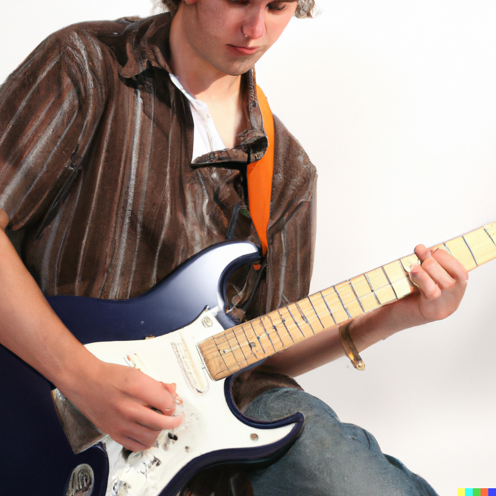
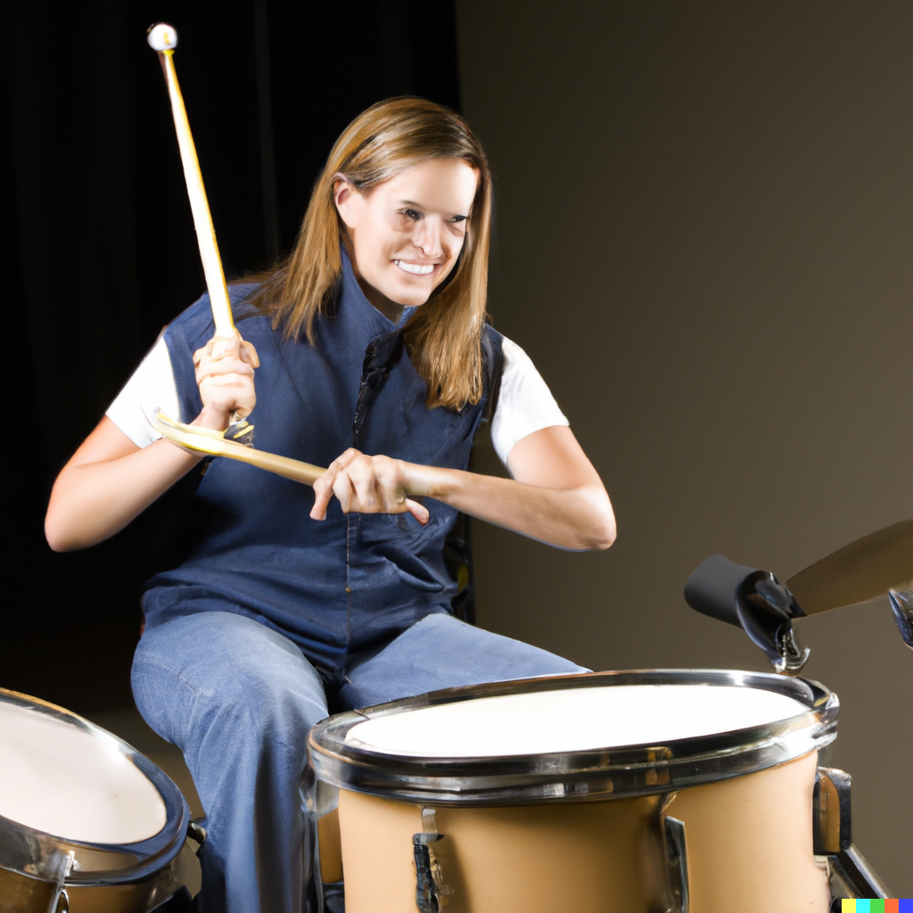

## about us 

Formed in the summer of 2010, The Wild Ones quickly made a name for themselves  
with their high-energy live performances and catchy, hook-laden songs.  
Comprised of four friends who met in college, the band - fronted by the dynamic  
duo of lead singers/guitarists Jake and Sara - quickly gained a devoted following   
on the local music scene.  

After releasing a series of well-received EPs, The Wild Ones dropped their debut  
full-length album, "Breaking Free," in 2015. The record, which featured the hit  
singles "Runaway" and "Take Me Higher," was a breakout success and established  
the band as one of the most exciting new acts in the industry.  

Since then, The Wild Ones have toured relentlessly, playing to packed houses all  
over the country and sharing stages with some of the biggest names in music. In  
2018, they released their sophomore album, "Shine," which spawned the hit singles  
"Gone" and "Wild Heart." The band shows no signs of slowing down, and their devoted  
fans can't wait to see what they'll do next.  

---

## Rachel James
**bass, lead vocal**

Born and raised in Los Angeles, California, Rachel James always had a passion for music. She picked up the
bass at the age of nine and quickly showed a natural talent for the instrument. By the time she was a teenager,
she was already performing in local bands and attracting the attention of industry insiders.

After graduating high school, Rachel moved to New York City to attend the prestigious Juilliard School of Music,
where she honed her skills and developed her unique style. Upon graduating, she was quickly signed to a record
label and released her debut album, "Bass Invasion," which garnered critical acclaim and established her as one
of the most exciting young bass players in the industry.

Since then, Rachel has toured the world with some of the biggest names in music and has released several
successful albums. She is known for her powerful and dynamic playing style, as well as her versatility and
ability to play a wide range of genres. When she's not on tour, Rachel enjoys spending time with her family
and working on new music in her home studio.

---

## Alex Thompson
**guitar, vocal**

Born and raised in the heart of Nashville, Tennessee, Alex Thompson always knew that he
was destined for greatness. From the moment he picked up his first guitar at the age of six,
he was hooked, and he spent every waking moment practicing and perfecting his craft.

By the time he was a teenager, Alex had already made a name for himself as one of the most talented
guitar players in the city, and it wasn't long before he was performing at local clubs and festivals.
In his early twenties, he was signed to a major record label and released his debut album,
"Guitar Hero," which quickly went platinum.

Since then, Alex has released a string of successful albums and has toured all over the world, playing
to packed arenas and festivals. He is known for his incredible technical proficiency and his ability
to play a wide variety of styles, from blues and rock to jazz and country. When he's not on tour,
Alex enjoys spending time with his family and working on new music in his home studio.

---

## John Doe
**keyboards, vocal**

At just 25 years old, Jane Doe has already made a name for herself as one of the most talented keyboard
players of her generation. Hailing from Los Angeles, Jane began playing the piano at the age of five and
quickly showed a natural aptitude for music. She went on to study at the Juilliard School of Music, where
she honed her skills and developed a love for all types of music, from classical to pop.

After graduating, Jane landed a spot in a popular indie band, and it wasn't long before she was performing
at festivals and touring all over the country. In 2020, she released her debut solo album, "Keys to Success,
"which featured a mix of original compositions and reimagined covers. The album was a critical and commercial
hit, and Jane has been in high demand ever since.

In her free time, Jane enjoys collaborating with other musicians and exploring new sounds and techniques.
She is also an avid supporter of music education and frequently gives back to her community by hosting
workshops and clinics for aspiring musicians.

---

## Sarah Johnson
**drums**

Born and raised in Los Angeles, California, Sarah Johnson always knew that she was destined for greatness.
From the moment she picked up her first drumstick at the age of five, she was hooked, and she spent every
waking moment practicing and perfecting her craft.

By the time she was a teenager, Sarah had already made a name for herself as one of the most talented drummers
in the city, and it wasn't long before she was performing at local clubs and festivals. In her early twenties,
she was signed to a major record label and released her debut album, "Drum Queen," which quickly went gold.

Since then, Sarah has released a string of successful albums and has toured all over the world, playing to
packed arenas and festivals. She is known for her incredible speed and precision, and her ability to play a
wide variety of styles, from rock and pop to jazz and funk. When she's not on tour, Sarah enjoys spending time
with her family and working on new music in her home studio.

